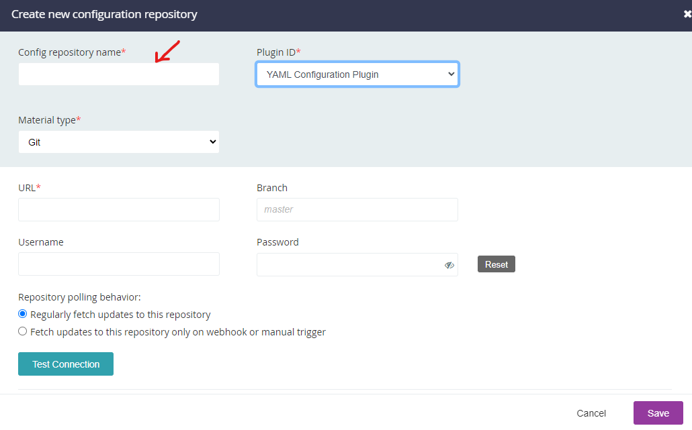

# GoCD Configuration Repository - LabVIEW PPLs

## Introduction

This repository contains both the `*.gocd.yaml` files, which provide a
definition of pipelines to be used on a GoCD server to build a series
of Packed Project Libraries (PPLs) with LabVIEW in Docker containers,
and also the python code (`scripts/*`) to generate those files.

It also contains a Dockerfile and simple Python file to run a webservice
that provides a mutex - this is necessary for the NIPKG publication from
Docker containers (because `nipkg feed-add-pkg` is not threadsafe).

## How to adapt to your own use

It is not expected that the .gocd.yaml files are particularly useful,
except as a reference guide for how such files can be structured.\
More information about the valid syntax can be found directly at the
repository for the plugin which processes the configurations: 
[gocd-yaml-config-plugin](https://github.com/tomzo/gocd-yaml-config-plugin).

Instead, this repository is published with the hope that the Python
scripts can be useful in generating a configuration file that suits your
build steps and repositories.

There is no requirement to use Python to generate such a `.gocd.yaml` file - 
but it was chosen here as a widespread language with a reportedly easy-to-understand
structure and syntax. You could use whatever language you liked (including,
of course, LabVIEW).

## GoCD pipelines and components

The YAML generated here provides a list of `pipeline` entries, containing
`stages`, `jobs` and `tasks`. A pipeline is used here for each separate library
that should be built into a PPL, and each pipeline has only one stage.\
That stage contains a set of 6 (almost identical) jobs, one for each target.

In GoCD, `jobs` are run in parallel, and so the configuration here sets
each job to have an `elastic-profile-id`, referencing one of the Docker images
constructed using the files in the
[oist/LabVIEW_Dockerfiles](https://github.com/oist/LabVIEW_Dockerfiles) repository.\
The release and debug pairs are built using the same image (but separate containers),
whilst separate images are used for each of "Windows_32", "Windows_64" and "cRIO"
targets.

Each job contains a series of `tasks`, where tasks are executed in series.
The tasks begin by 'downloading' and unzipping a copy of the 
[PPL_Builder](https://github.com/oist/Chakraborty_PPL-Builder) repository,
which is done to reduce the number of git operations and the size of the
resulting folder.

The job then goes on to install nipkg files if the PPL has dependencies, and
set up a Directory-Junction link to allow those PPLs (installed in a directory
unrelated to the pipeline build directory) to be found as expected.

After carrying out some "ls"-like steps to aid in debugging and provide some
reassurance in the build logs of a correct initial setup, the core `G-CLI` build
task is carried out using the code acquired via the zip file in the first tasks.

## Adding a GoCD Config Repository

Configuration repositories can be added via the web interface to a GoCD server via the
ADMIN > Config Repositories page (/go/admin/config_repos).

Adding a new config repository brings up a dialog like this one


The "Config repository name" (indicated) is also important for use with testing (see below).
If you are using SSH keys to access your config repository, then you don't need
to provide a Username and Password for your Git repository.

If you select the "Fetch updates to this repository only on webhook or manual trigger"
then you can manually trigger using the refresh-icon from the same page:


## Comments on the YamlGenerator.py, Constants.py and Generate_PPL_Pipelines.py files

Within the [YamlGenerator.py](./scripts/YamlGenerator.py) and [Constants.py](./scripts/Constants.py) files,
there are many variables defined for the purpose of generating
[YAML aliases](https://github.com/tomzo/gocd-yaml-config-plugin#yaml-aliases),
in order to reduce the output file size.\
This sometimes makes the code seem excessively fragmented, when a function
could be used to generate the same output more tidily (and with a function
name that provided self-documenting code).\
However, use of a function provides a new object on each run, and then the
aliases are not created (comparison is by reference/id, not content).\
Hopefully splitting the majority of the constants into a separate file eases
the reading of the YamlGenerator.py file.

[Generate_PPL_Pipelines.py](./scripts/Generate_PPL_Pipelines.py) is the file
which should be executed using Python to generate the
[LabVIEW_PPL-Pipelines.gocd.yaml](./LabVIEW_PPL-Pipelines.gocd.yaml) file.\
It clones a list of repositories (in `repoList.txt`) and then searches for
the libraries named in that file within the repository that is cloned.\
It also parses a `<libraryName>.mk` file to build a list of dependencies.
This allows the repository containing a library to declare on what it depends,
rather than needing a global declaration of dependencies. Nested dependencies
are automatically detected and scheduled appropriately by GoCD.

## Testing a configuration file

GoCD has an offline tool that can be used to test the validity of a "config-repo" file,
such as the .gocd.yaml files produced by the scripts in this repository.

This tool can be helpful when creating new files or modifying scripts, since it
provides faster feedback and does not require updating the config on the server,
creating a new attempt to parse the file, and potentially errors that could disrupt
the GoCD Server.

The tool can be found (together with instructions) in the
[gocd-cli](https://github.com/gocd-contrib/gocd-cli) repository.
Since I had some difficulty setting this up (especially on a Windows machine), a
set of additional notes is provided below for those who want to try and use this
with their own config-repository files.

The steps below assume that you're starting in your home (WSL) directory,
however this is not a requirement - if you want to place files elsewhere,
adapt your PATH as needed.
It also assumes that the GoCD Server is running locally for testing - if
you have a remote GoCD server, change the server-url as appropriate.

Changes to your PATH and updates to the gocd server-url can be placed in your
.bashrc file or similar as is common with Ubuntu, if desired on all starts.
Alternatively, you can create a script to carry out repetitive steps.

1. Using Ubuntu via WSL2, download and make available `go`:
```
wget https://go.dev/dl/go1.19.linux-amd64.tar.gz
sudo tar -C /usr/local -xzf go1.19.linux-amd64.tar.gz
go version # Expect to see "go version go1.19 linux/amd64"
```

2. Clone the [gocd-cli](https://github.com/gocd-contrib/gocd-cli) repository
```
git clone https://github.com/gocd-contrib/gocd-cli
```

3. Run the build script.
This requires internet access from within your WSL2 system.
If you have issues fetching dependencies, particularly with VPN, you may
need to search online (there are some well-known issues, often including VPN connections and WSL2).
```
cd gocd-cli
./build.sh
```

4. Add the gocd directory to your (Linux) path if desired (adjust based on location)
```
export PATH=${PATH}:${HOME}/gocd-cli/
gocd # Expect to see a help-like output, starting with "A command-line companion to a GoCD server"
```

5. Configure the connection to the GoCD server. You can get the IP 
address from `/etc/resolv.conf` under the `nameserver` entry
```
cat /etc/resolv.conf
# This file was automatically generated by WSL. To stop automatic generation of this file, add the following entry to /etc/wsl.conf:
# [network]
# generateResolvConf = false
nameserver 172.18.208.1

gocd config server-url http://172.18.208.1:8153/go # IP address of the WSL2 host (i.e. the server)
```
6. Run the `--preflight` operation to test your config file
```
gocd configrepo --yaml preflight mynewconfigfile.gocd.yaml
```

If you have an existing uploaded version of the config file, you might see
many instances (one per pipeline) of:
```
# You have defined multiple pipelines called 'blah'. Pipeline names must be unique. Source(s): [preflighted <NEW REPO>, ...]
```
In that case, you can pass the existing configuration repository name
(set in GoCD Server), where file1.gocd.yaml and file2.gocd.yaml are
files to check, and "PPL_Builder" is the name given in the [GoCD Server
configuration](#config-repo-name)
```
gocd configrepo --yaml preflight -r "PPL_Builder" file1.gocd.yaml file2.gocd.yaml
```
